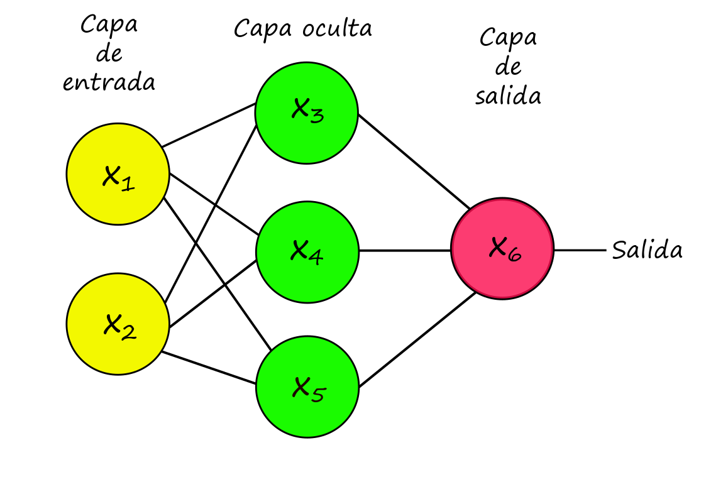

# (PART) Redes neuronales {-}

# ¿Qué es una red neuronal?

Las redes neuronales artificiales están inspiradas en la forma en la que las neuronas de nuestro cerebro trabajan en conjunto para resolver una tarea compleja. Éstas modelan una variable respuesta, ya sea de tipo continua o categórica, como función de las covariables a través de la composición de funciones no lineales.

De manera general, una red nueronal consiste de una _arquitectura_, una _regla de activación_ y una _regla de salida_.

__Arquitectura:__ Puede ser descrita vía un gráfo dirigido cuyo nodos son llamados _neuronas_. Existen una grán cantidad de arquitecturas dependiendo de la naturaleza del grafo i.e. de las relaciones entre los nodos. Una descripción bastante completa de las distintas arquitecturas y sus nombres puede ser consultada  

__Regla de activación:__ Típicamente el valor en cada nodo $v$ puede ser calculado como $$x_v = f(\sum_{u \rightarrow v}\beta_{uv}x_u)$$ donde la suma se obtiene sobre los nodos _predecesores_ de $v$ y $\beta_{uv}$ son los coeficientes (desconocidos) de la red.

A la función $f(\cdot)$ se le conoce como _función de activación_. Las más comúnmente usadas son la _sigmoide logística_ $f(x) = \frac{e^y}{1+e^y}$ y la función _rectificadora_ $f(x) = \max\{{y,0}\}$

## Ejemplo

Dada la siguiente arquitectura calcularemos el valor de salida dado por el nodo $x_6$.

$$\begin{align*}
x_{6} & =f\left(\beta_{3,6}\cdot x_{3}+\beta_{4,6}\cdot x_{4}+\beta_{5,6}\cdot x_{5}\right)\\
 & \hookrightarrow x_{3}=f\left(\beta_{1,3}\cdot x_{1}+\beta_{2,3}\cdot x_{2}\right)\\
 & \hookrightarrow x_{4}=f\left(\beta_{1,4}\cdot x_{1}+\beta_{2,4}\cdot x_{2}\right)\\
 & \hookrightarrow x_{5}=f\left(\beta_{1,5}\cdot x_{1}+\beta_{2,5}\cdot x_{2}\right)\\
 & \vdots
\end{align*}$$

donde $f(\cdot)$ es la función de activación.

Si suponemos que $f(x) = \mathbb{I}(x)$ entonces el problema a resolver será el de regresión lineal.

__Nodos de _sesgo:___ Dependiendo de la utilidad, podríamos estar interesados, como en el problema de regresión lineal, en un término de intercepto o de nivel base, para ello puede simplemente crearse un nodo extra cuyo valor sea la constante 1.

__Regla de salida:__ En el nodo de salida $v$ se calcula: $$s_v = \sum_{u\rightarrow v}\beta_{uv}x_u$$ y en lugar de aplicar la función de activación $f(\cdot)$, se usa una regla de salida para obtener el valor o vector de ajuste/predicción.

Por ejemplo, en un problema de clasificación de $N$ clases, la _capa de salida_ consitirá de $N$ nodos, cada uno asociado a cada clase; la predicción/ajuste $\hat{y}\in \mathbb{R}^p$  está dada por $$\hat{y}=\arg max\{s_{vn}\}$$

Notemos que para este ejemplo, si la arquitectura de la red carece de _capas_ intermedias/ocultas y con función de activación _sigmoide logística_ entonces el modelo corresponde al de regresión logística múltiple.

Al igual que en los modelos logísticos, podemos hacer que la red neuronal tenga como salida un vector de probabilidades $z=(z_1,\dots,z_N)$ dado por $$z_n=\frac{e^{s_{v_n}}}{e^{s_{v_1}}+\dots+e^{s_{v_N}}}$$

Al proceso de normalización de los valores _exponenciados_ se le conoce como la operación _softmax_.

De manera particular una red neuronal cuya arquitectura está representada por un grafo dirigido no cíclico, (_feedforward_) con función de activación _sigmoide logística_ y regla de salida _softmax_ es un modelo paramétrico descrito por:

$$y \sim Multinomial(1, (p_1,\dots,p_N)$$
$$(p_1,\dots,p_N)=g^{nnet}(x_v; \{\beta_{uv}:u\rightarrow v\})$$

# Teorema de Universalidad

La flexibilidad y el poder de las redes neuronales radica en la estructura de composición de funciones de activación no lineales. El siguiente teorema implica que una red neuronal puede aproximar cualquier función en particular nos es relevante el poder aproximar cualquier modelo no paramétrico de regresión.

__Teorema.__ Sea $\Delta^{L}=\left\{ \left(y_{1},\ldots,y_{L}\right)\in\mathbb{R}_{\geq0}^{L}\,|\,y_{1}+\dots+y_{L}=1\right\} \in \mathbb{R}^{L}$, y $B\subseteq\mathbb{R}^{p}$ un conjunto acotado que contiene al origen y $\mu$ una medida de probabilidad en $B$. 

Para $g:\,B\rightarrow\Delta$ una función medible arbitraria existe una red neuronal totalmente conectada (_feedforward_), de una capa oculta que tiene $m$ neuronas, activación sigmoide y regla output softmax tal que su correspondiente función de probabilidades $g^{NNET}$ satisface:

$$\int_{B}\left\lVert g-g^{NNET}\right\lVert _{2}^{2}d\mu\leq\frac{Clog^{2}\left(n\right)}{n}$$

para alguna constante universal $C$.

# Entrenamiento de una red neuronal

En el ámbito del _machine learning_ se le conoce como entrenamiento al proceso de encontrar _buenos_ estimadores de los parámetros del mmodelo usado, en este caso, de la red neuronal.

Sea $\beta = (\beta_{uv}; u\rightarrow v)$ el vector de parámetros de una red neuronal. Dados los datos de entrenamiento $(x^1,y^1),\dots,(x^n,y^n)$, la log-verosimilitud de $\beta$ está dada por:

$${\it l}\left(\beta\right)=\sum_{i=1}^{n}\sum_{{\it l}=1}^{L}\mathbb{I}_{\left\{ y_{i}={\it l}\right\} }log\left(\frac{e^{s_{v_{{\it l}}}\left(x_{i},\beta\right)}}{e^{s_{v_{1}}\left(x_{1},\beta\right)}+\dots+e^{s_{v_{L}}\left(x_{L},\beta\right)}}\right) =\colon \sum_{i=1}^{n}{\it l}_{i}\left(\beta\right)$$
A continuación mostraremos cómo podemos maximizar la log-verosimilitud para obtener los parámetros.

## Back-propagation

Gracias a la estructura de composición de funciones del modelo, la derivada puede encontrarse _fácilmente_ usando la regla de la cadena.

### Ejemplo.

Consideremos la siguiente red neuronal:

Dado, el ejemplo de entrenamiento $x^i=(x_1^i,x_2^i)$ con etiqueta/valor $y^i$ la red neuronal calcula la probabilidad de salida $z_1=\mathbb{P}[Y=1|X = x^i]$ de la siguiente forma:

$$\begin{align*}
s_{3}=\beta_{1,3}x_{1}+\beta_{2,3}x_{2} & \,\,\,\,\,\,\,\,\,\,x_{3}\leftarrow f\left(s_{3}\right)\\
s_{4}=\beta_{1,4}x_{1}+\beta_{2,4}x_{2} & \,\,\,\,\,\,\,\,\,\,x_{4}\leftarrow f\left(s_{4}\right)\\
s_{5}=\beta_{1,5}x_{1}+\beta_{2,5}x_{2} & \,\,\,\,\,\,\,\,\,\,x_{5}\leftarrow f\left(s_{5}\right)\\
s_{6}=\beta_{3,6}x_{3}+\beta_{4,6}x_{4}+\beta_{5,6}x_{5} & \,\,\,\,\,\,\,\,\,\,z_{1}\leftarrow f\left(s_{6}\right)
\end{align*}$$

Donde, por facilidad estamos considerando que $f(x)=\frac{e^x}{1+e^x}$.

El valor de la log-verosimilitud para este ejemplo de entrenamiento se calcula como:

$${\it l}_{i}\left(\beta;\,\left(x^{i},\,y^{i}\right)\right)=\mathbb{I}_{\left\{ y^{i}=1\right\} }log\left(z_{1}\right)+\mathbb{I}_{\left\{ y^{i}=2\right\} }log\left(1-z_{1}\right)$$

Y el _gradiente estocástico_ como:

- $\frac{\partial l}{\partial z_1} = \frac{\mathbb{I}_{\{y^1=1\}}}{z_1}-\frac{\mathbb{I}_{\{y^1=2\}}}{1-z_1}$

- $\frac{\partial l}{\partial s_6} = \frac{\partial l}{\partial z_1}\cdot f'(s_6)$

- $\frac{\partial l}{\partial \beta_{3,6}} = \frac{\partial l}{\partial s_6}\cdot x_3$

- $\frac{\partial l}{\partial \beta_{4,6}} = \frac{\partial l}{\partial s_6}\cdot x_4$

- $\frac{\partial l}{\partial \beta_{5,6}} = \frac{\partial l}{\partial s_6}\cdot x_5$

- $\frac{\partial l}{\partial x_3} = \frac{\partial l}{\partial s_6}\cdot \beta_{3,6}$

- $\frac{\partial l}{\partial x_4} = \frac{\partial l}{\partial s_6}\cdot \beta_{4,6}$

- $\frac{\partial l}{\partial x_5} = \frac{\partial l}{\partial s_6}\cdot \beta_{5,6}$

- $\frac{\partial l}{\partial s_3} = \frac{\partial l}{\partial x_3}\cdot f'(s_3)$

- $\frac{\partial l}{\partial s_4} = \frac{\partial l}{\partial x_4}\cdot f'(s_4)$

- $\frac{\partial l}{\partial s_4} = \frac{\partial l}{\partial x_5}\cdot f'(s_5)$

- $\frac{\partial l}{\partial \beta_{1,3}} = \frac{\partial l}{\partial s_3}\cdot x_1$

- $\frac{\partial l}{\partial \beta_{2,3}} = \frac{\partial l}{\partial s_3}\cdot x_2$

- $\frac{\partial l}{\partial \beta_{1,4}} = \frac{\partial l}{\partial s_4}\cdot x_1$

- $\frac{\partial l}{\partial \beta_{2,4}} = \frac{\partial l}{\partial s_4}\cdot x_2$

- $\frac{\partial l}{\partial \beta_{1,5}} = \frac{\partial l}{\partial s_5}\cdot x_1$

- $\frac{\partial l}{\partial \beta_{2,5}} = \frac{\partial l}{\partial s_5}\cdot x_2$

- $\frac{\partial l}{\partial x_1} = \frac{\partial l}{\partial s_3}\cdot \beta_{1,3}+\frac{\partial l}{\partial s_4}\cdot \beta_{1,4}+\frac{\partial l}{\partial s_5}\cdot \beta_{1,5}$

- $\frac{\partial l}{\partial x_2} = \frac{\partial l}{\partial s_3}\cdot \beta_{2,3}+\frac{\partial l}{\partial s_4}\cdot \beta_{2,4}+\frac{\partial l}{\partial s_5}\cdot \beta_{2,5}$

En resúmen, para optimizar la verosimilitud por gradiente estocástico debemos seguir lo siguientes pasos (llamados _back-propagation):

__1.__ Inicializar los parámetros $\hat{\beta}^{(0,n)}=\{\hat{\beta_{u,v}}^{(0,n)}:u\rightarrow v\}$

__2.__ Para cada fase de entrenamiento $t=1,2,\dots$
  
  Para $i = 1,2,\dots,n$
  - Obtener el vector de probabilidades $z = (z_1,\dots,z_N)$ usando como input el _ejemplo_ $x^i$ y los parámteros $\hat{\beta}^{(t, i-1)}$
  
  - Obtener las derivadas parciales del la log-verosimilitud con respecto a:
  
  $$\{z_l:1\leq l\leq N\} \ \{s_v:v\in S_M\} \ \{\beta_{uv}:u\in S_{M-1}, v\in S_M\}$$
  $$\{x_v:v\in S_{M-1}\} \ \{s_v:v\in S_{M-1}\} \ \{\beta_{uv}:u\in S_{M-2}, v\in S_{M-1}\}$$
  $$\{x_v:v\in S_{M-2}\} \ \{s_v:v\in S_{M-2}\} \ \{\beta_{uv}:u\in S_{M-3}, v\in S_{M-1}\}$$
  $$\vdots$$
  $$\{x_v:v\in S_2\} \ \{s_v:v\in S_2\} \ \{\beta_{uv}:u\in S_1, v\in S_2\}$$
  
  en ese orden.
  
__3.__ Actualizar los parámetros $$\hat{\beta_{uv}}^{(t,i)} \leftarrow \hat{\beta_{uv}}^{(t,i-1)}+\alpha \cdot \frac{\partial l_i}{\partial \beta_{uv}}$$

En general, a este procedimiento de optimización se le conoce como _descenso gradiente_.

## Saturación

Si durante el proceso de entrenamiento, algún nodo $v$ tiene una valor $|s_v|$ muy _grande_ entonces el valor de $f'(s_v)$ será muy cercano a cero para funciones de activación sigmoides.

Debido a la regla de la cadena, los valores de $\beta_{uv}$ se moverán muy lentamente hacia el óptimo, en este caso se dice que el nodo $v$ está saturado.

Para evitar problemas de saturación al inicio del entrenamiento comúnmente debemos estandarizar las covariables para que tengan media cero y varianza unitaria.

También es conveniente inicializar los parámetos $\hat{\beta}^{(0,n)}$ cercanos a cero, comúnmente elegidos uniformemente entre $[-c,c]$ para $c \in (0,1)$.

Sin embargo debemos tener cuidado pues si $\hat{\beta}^{(0,n)}=0$ entonces $\frac{\partial l}{\partial x_v}=0 \ \forall \ v\in S_{M-1}$ lo que hará que el algoritmo _no se mueva_.

## Regularización

Un problema típico en las redes neuronales es que suelen _sobre ajustar_ los datos de entrenamiento dado que suelen haber más parámetros que variables.

Una forma de _regularizar_ es imponer una penalización equivalente al cuadrado de los parámetros, también llamada _ridge_ o _L2_, a la log-verosimilitud y maximizar respecto a esta log-verosimilitud penalizada.

$${\it l}\left(\beta\right)^{ridge}={\it l}\left(\beta\right)+\frac{\lambda}{2}||\beta||_2^2 = \sum_{i=1}^{n}\sum_{{\it l}=1}^{L}\mathbb{I}_{\left\{ y_{i}={\it l}\right\} }log\left(\frac{e^{s_{v_{{\it l}}}\left(x_{i},\beta\right)}}{e^{s_{v_{1}}\left(x_{1},\beta\right)}+\dots+e^{s_{v_{L}}\left(x_{L},\beta\right)}}\right)+\frac{\lambda}{2}||\beta||_2^2$$

## Ejemplo

...WIP...