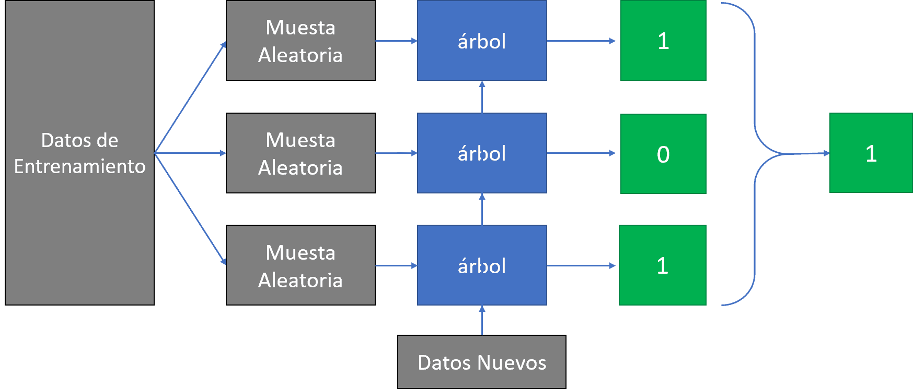

# (PART) Random Forests {-}

# ¿Qué es un random forest?

Random Forest, al igual que el árbol de decisión, es un modelo de aprendizaje supervisado para clasificación (aunque también puede usarse para problemas de regresión).

Es una técnica de aprendizaje automático muy popular. Los Random Forests tienen una capacidad de generalización muy alta para muchos problemas.

Los Random Forests se construyen a través de árboles de decisión. Los árboles tienden a aprender muy bien los datos de entrenamiento pero su generalización no es tan buena, por lo tanto tienen la tendencia de sobre-ajustar (overfit). La solución para evitar esto es la de crear muchos árboles y que trabajen en conjunto y estos son los Random Forests.

Un Random Forest es un conjunto (ensemble) de árboles de decisión combinados con bagging. Al usar bagging, lo que en realidad está pasando, es que distintos árboles ven distintas porciones de los datos. Ningún árbol ve todos los datos de entrenamiento. Esto hace que cada árbol se entrene con distintas muestras de datos para un mismo problema. De esta forma, al combinar sus resultados, unos errores se compensan con otros y tenemos una predicción que generaliza mejor.



# ¿Cómo funciona Random Forest?

Random Forest funciona así:

- Seleccionamos k variables (columnas) de las m totales (siendo k menor a m) y creamos un árbol de decisión con esas k características.

- Creamos n árboles variando siempre la cantidad de k variables y también podríamos variar la cantidad de muestras que pasamos a esos árboles (esto es conocido como “bootstrap sample”)

- Tomamos cada uno de los n árboles y le pedimos que hagan una misma clasificación. Guardamos el resultado de cada árbol obteniendo n salidas.

- Calculamos los votos obtenidos para cada “clase” seleccionada y consideraremos a la más votada como la clasificación final de nuestro “bosque”.


En este algoritmo la aleatoriedad le brinda flexibilidad suficiente como para poder obtener gran variedad de árboles y de muestras que en su conjunto aparentemente caótico, producen una salida concreta.

## Ventajas y Desventajas de Random Forest

Vemos algunas de sus ventajas son:

- Funciona bien -aún- sin ajuste de hiperparámetros

- Funciona bien para problemas de clasificación y también de regresión.

- Al utilizar múltiples árboles se reduce considerablemente el riesgo de overfiting

- Se mantiene estable con nuevas muestras puesto que al utilizar cientos de árboles sigue prevaleciendo el promedio de sus votaciones.

Y sus desventajas:

- En algunos datos de entrada “particulares” random forest también puede caer en overfitting

- Es mucho más “costo” de crear y ejecutar que “un sólo árbol” de decisión.

- Puede requerir muchísimo tiempo de entrenamiento

- Random Forest no funciona bien con datasets pequeños.

- Es muy difícil poder interpretar los ¿cientos? de árboles creados en el bosque, si quisiéramos comprender y explicar a un cliente su comportamiento.


## Hiper-parámetros más útiles del Random Forest:

**n_estimators:** número de árboles que va a tener el bosque. Normalmente cuantos más mejor, pero a partir de cierto punto deja de mejorar y sólo hace que vaya más lento. Un buen valor por defecto puede ser el uso de 100 árboles.

**n_jobs:** número de cores que se pueden usar para entrenar los árboles. Cada árbol es independiente del resto, así que entrenar un bosque aleatorio es una tarea muy paralelizable. Por defecto sólo utiliza 1 core de la CPU. Para mejorar el rendimiento puedes usar tantos cores como estimes necesario. Si usas n_jobs = -1, estás indicando que quieres usar tantos cores como tenga tu máquina.

**max_features:** usa forma de garantizar que los árboles son diferentes, es que todos se entrenan con una muestra aleatoria de los datos. Si queremos que todavía sean más diferentes, podemos hacer que distintos árboles usen distintos atributos. Esto puede ser útil especialmente cuando algunos atributos están relacionados entre sí.

## Otros parámetros también disponibles para árboles:

**max_depth:** la profundidad máxima del árbol. 

**min_samples_split:** número mínimo de muestras necesarias antes de dividir este nodo. También se puede expresar en porcentaje.

**min_samples_leaf:** número mínimo de muestras que debe haber en un nodo final (hoja). También se puede expresar en porcentaje.

**max_leaf_nodes:** número máximo de nodos finales

# Random forest en R

```{r, warning=FALSE}
# Carga el paquete específico del método Random Forest
library(randomForest)

# Carga de datos inicial, tipos de flores con diferentes caracter?sticas 
data(iris)

# Selección de una submuestra del 70% de los datos
set.seed(456)
training_sample <- sample(c(TRUE, FALSE), nrow(iris), replace = T, prob = c(0.7,0.3))
train <- iris[training_sample, ]
test <- iris[!training_sample, ]

# Ajustar modelo
modelo <- randomForest(Species~., data=train)

# Resumen del ajuste del modelo
modelo

# Importancia de las variables
modelo$importance

# Hacer predicciones
predicciones <- predict(modelo, test)

# Matriz de confusión
(mc <- with(test,table(predicciones, Species)))

# % correcto
100 * sum(diag(mc)) / sum(mc)
```

__Referencias__

$\href{https://www.iartificial.net/random-forest-bosque-aleatorio/}{https://www.iartificial.net/random-forest-bosque-aleatorio/}$

$\href{https://www.aprendemachinelearning.com/random-forest-el-poder-del-ensamble/}{https://www.aprendemachinelearning.com/random-forest-el-poder-del-ensamble/}$